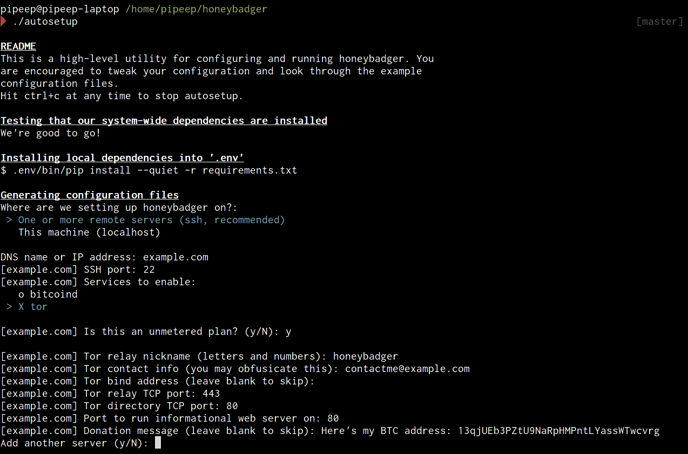

ansible-honeybadger
===================

[](https://gemnasium.com/PiPeep/ansible-honeybadger)

[](https://gitter.im/PiPeep/ansible-honeybadger?utm_source=badge&utm_medium=badge&utm_campaign=pr-badge&utm_content=badge)

**Because [Honeybadger don't give a sh*t!][youtube]**

[youtube]: https://www.youtube.com/watch?v=4r7wHMg5Yjg

What's it do?
-------------

Honeybadger sets up tor *and/or* bitcoind on your cheap spare VPS boxes. You can
think of it as an extended and improved version of [Tor Cloud]. We handle the
grunt work so you can get on with your life. **Set it and forget it.**

Tor and Bitcoin are dependent on their P2P networks to function. These P2P nodes
are often difficult to run, but they're important to many people. Tor is heavily
used in countries like China and Russia, where there is no freedom of speech.
Bitcoin promises both the technical and social benefits of a currency outside
the control of any state or central bank.

[Tor Cloud]: https://cloud.torproject.org/

### Primary Services

-   **tor** installed fresh from the torproject.org repository
-   **bitcoind** with included monit scripts

### Support Services

-   **unattended-upgrades** for automatic updates
-   **monit** to recover from application crashes
-   **ufw** will agressively block any unused ports
-   **nginx** proxies tor's DirPort to port 80, while allowing the port to still
    be used for monitoring tools

### Monitoring Tools

-   **tor-arm** is a cli monitor for tor
-   **htop** provides a nice UI for monitoring system load
-   **aptitude** is a better version of apt-get, with a curses UI

### Configuration

-   **passwordless ssh** improves security against weak passwords
-   **passwordless sudo** yields convenience, utilizing our safe ssh config
-   **ssh command users** eg. `ssh htop@example.com`

Goals
-----

-   **Easy as possible** &mdash; The hardest part is figuring out how much
    bandwidth to allocate.

-   **Safe defaults** &mdash; Tor isn't configured to run as an exit node by
    default. You may configure this, but by default you should *never* receive
    any abuse complaints.

-   **Services are dumb relays** &mdash; As the person running this, you get
    nothing out of it, except a warm fuzzy feeling in your heart.

-   **Zero-consequence** &mdash; Since you don't depend on it, and since P2P
    networks like tor and bitcoin are resilient, it shouldn't matter if things
    go down. We make it easy to re-deploy if a box catches fire.

-   **Easy monitoring** &mdash; Running a headless box is no fun without lots of
    numbers and graphs to show for it!

-   **Battle tested** &mdash; I've thrown these scripts on as many boxes as I
    can find. If you find a hosting provider with a configuration that breaks
    Honeybadger, [it's our bug, and we'll work around it][issues].

You can buy shitty, unreliable VPSes, and throw Honeybadger on them! If your
host oversells their RAM and kills your processes, monit will start them back
up. If your provider is run by a 12-year-old and your VPS goes offline each
week, Honeybadger will ensure everything works when it comes back up. If your
harddrive dies in a fire &mdash; just re-run Honeybadger.

[issues]: https://github.com/pipeep/ansible-honeybadger/issues

Requirements
------------

-   The target server should be running **Ubuntu 14.04 LTS**. Right now, this is
    our only deployment target, but almost every hosting provider supports it.

-   **Honeybadger assumes it's the only thing on your server**, so don't put it
    next to your corporate email!

-   If you want to enable bitcoind, [you'll need enough **disk space** to store
    the blockchain, with some room to grow][blockchain size].

-   Tor runs poorly with 96mb of RAM, okay with 128mb of RAM, and can probably
    steadily max out an unmetered 100mbit port with 256mb of RAM. Keep in mind
    that budget OpenVZ providers will often oversell RAM. A 32-bit distribution
    will reduce RAM consumption. A 64-bit distribution may reduce CPU usage.

[blockchain size]: https://blockchain.info/charts/blocks-size

Running
-------

Deployment instructions are dependent on your desktop computer's setup.

- [I'm enlightened and have Debian or Ubuntu on my
  desktop](docs/setup_debian.md)
- [I'm incredibly boring and also run Windows](docs/setup_windows.md)
- [I paid to much for my computer and use Mac OS X](docs/setup_osx.md)
- [I smell funny and use Arch Linux](docs/setup_arch.md)

*If someone's not running the above platforms and can translate the instructions
and autosetup tools for their platform, the help would be greatly appreciated.*



### Updating

Always check [the upgrade documentation](docs/updating.md) before updating.

Monitoring Tools
----------------

We set up a number of ssh users that can be used to conveniently access
monitoring and maintenance tools:

- `ssh htop@example.com`
- `ssh tor-arm@example.com`
- `ssh aptitude@example.com`
- `ssh monit@example.com`
- `ssh bitcoind-getinfo@example.com`
- `ssh bitcoind-getpeerinfo@example.com`

These save you a bit of typing and give you some cool geek cred. They copy the
ssh `authorized_keys` files from the root user, so if you add any more ssh keys,
simply re-run ansible-honeybadger.

We also set up a page on port 80 for you using nginx ([example][hostus]). This
doesn't inhibit Tor from using port 80 however, because we can [proxy the
DirPort][dirport proxy].

[hostus]: http://hostus.benjam.info/
[dirport proxy]: https://trac.torproject.org/projects/tor/wiki/doc/TorFAQ#HowcanImakemyrelayaccessibletopeoplestuckbehindrestrictivefirewalls

Bandwidth Throttling
--------------------

While Honeybadger is a great way to ~~abuse~~ fully utilize an unmetered
bandwidth plan, many providers limit your monthly bandwidth usage.

There's [no easy way to throttle bitcoind][throttle bitcoind], although there
are workarounds using iptables. If you're on a metered plan, it's suggested you
disable bitcoind.

It's easy to throttle tor. Simply set the `tor_bandwidth_rate` and
`tor_bandwidth_burst` variables.

[throttle bitcoind]: https://github.com/bitcoin/bitcoin/issues/273

Backing up Tor's `secret_id_key`
--------------------------------

Tor's `secret_id_key` gets backed up to `secrets/tor/example.com_secret_id_key`,
where `example.com` is the inventory hostname. Saving this file, along with your
`hosts`, `host_vars`, and `group_vars` config files will allow you to restore a
tor relay if the original host goes down. Honeybadger will find a
`secret_key_id` if it's in the right location, and restore it automatically.

Restoring a Tor relay allows you to avoid Tor's multiple-month-long bandwidth
discovery process, and works even if your IP changes.

Known Issues
------------

### UFW Doesn't Always Work on OpenVZ

If you're on OpenVZ, you might see something like:

```
msg: ERROR: problem running ufw-init
modprobe: ERROR: ../libkmod/libkmod.c:507 kmod_lookup_alias_from_builtin_file() could not open builtin file '/lib/modules/2.6.32-042stab090.5/modules.builtin.bin'
modprobe: FATAL: Module nf_conntrack_ftp not found.
modprobe: ERROR: ../libkmod/libkmod.c:507 kmod_lookup_alias_from_builtin_file() could not open builtin file '/lib/modules/2.6.32-042stab090.5/modules.builtin.bin'
modprobe: FATAL: Module nf_nat_ftp not found.
modprobe: ERROR: ../libkmod/libkmod.c:507 kmod_lookup_alias_from_builtin_file() could not open builtin file '/lib/modules/2.6.32-042stab090.5/modules.builtin.bin'
modprobe: FATAL: Module nf_conntrack_netbios_ns not found.
ip6tables-restore: line 4 failed
ip6tables-restore: line 73 failed
ip6tables-restore: line 30 failed
sysctl: permission denied on key 'net.ipv4.tcp_sack'

Problem running '/etc/ufw/before6.rules'
Problem running '/lib/ufw/user6.rules'
```

This is because UFW has compatibility issues with some OpenVZ setups. You can
simply turn off UFW in your hosts file:

```
example.com  ufw=False
```

### "I think my provider is killing `tor`"

Some OpenVZ providers will automatically run `killall tor` instead of simply
disallowing Tor in the AUP or opening a ticket. This is a sleazy thing to do,
but we have our own sleazy workaround. You can simply change the process name in
the appropriate `host_vars` file:

```
tor_procname: nginx
```

This uses `LD_PRELOAD` to inject a [library overwrites the process
name][electrum/procname], and reconfigures monit appropriately.

Keep in mind that this trick doesn't make Tor invisible to your provider, but
will at least prevent their scripts from working.

[electrum/procname]: https://github.com/electrum/procname

License
-------

Unless otherwise noted in the files themselves, all files in this repository are
licensed under the MIT license.
